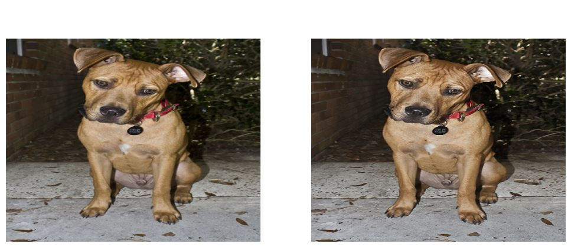

# Image-Enhancer
Built a model that improves image resolution and removes any watermarks present. This repo contains two notebooks, each of which try to
solve the problem of Image Resolution.   
  
The first one uses a GAN(Generative Adversial Network) model to improve image resolution. The loss functions used for the generator and 
the critic are Mean squared error and BinaryCrossEntropy respectively. By using the fastai library, we were able to train both the 
generator and the critic in less than 2 hours and get a descent output. However we can see that the GanLearner's output is of poor quality
when compared to the actual output that we want. Features such as eyes were not upto the mark and it was concluded that we need to solve the problem some other way. The loss functions selected couldn't capture the the features that humans perceive as important.  
 

  
So we go about a different way in trying to enhance these images. We now use a Unet style architecture, using a Resnet34 model as the
encoder and decoder along with Perceptual loss or Feature loss as our loss function. It has beem referenced from this paper on 
[Perceptual Losses for Real-Time Style Transfer and Super-Resolution](https://arxiv.org/abs/1603.08155). After training for a while, it appears that we get really good results on using this model.
 
 
 
 
